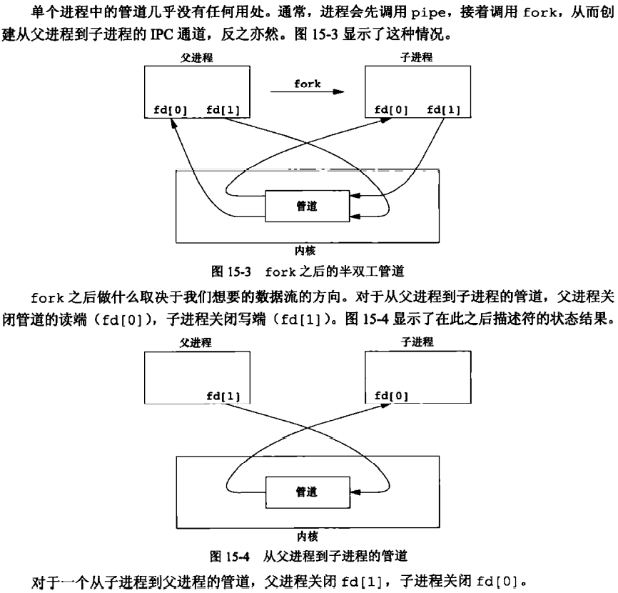
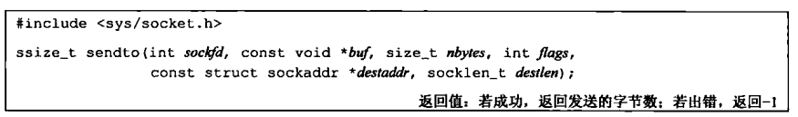
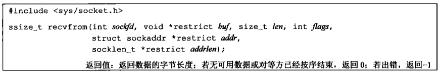
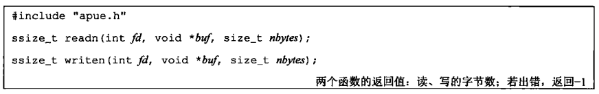

# 流媒体广播系统


==多播==

[(45 封私信 / 80 条消息) 现在直播、录播等平台是通过“组播”的方式下发流量的吗？ - 知乎 (zhihu.com)](https://www.zhihu.com/question/65869123)

CDN的全称是Content Delivery Network，即内容分发网络。

==通信框架图==


## 一、包结构

在 include/proto.h 中定义了三个结构体。包括频道包和节目单包，节目单包中的内容是一个 msg_lisentry_st 结构体的数组。
一个节目单包如下图所示，为了能将节目单中各个频道的内容区分开，在 msg_lisentry_st 结构体中需要定义一个len来记录每个频道内容的长度(类似于TCP的粘包问题)。


## 二、客户端的搭建

### 2.1 include/proto.h

#### 2.1.1 关于TCP UDP数据包大小的限制

https://blog.csdn.net/caoshangpa/article/details/51530685

结论：在实际应用中
+ 用UDP协议发送时，用sendto函数最大能发送数据的长度为：65535-IP头(20) - UDP头(8) = 65507 字节
+ 用TCP协议发送时，由于TCP是数据流协议，因此不存在包大小的限制，这是指在使用send函数时，数据长度参数不受限制。而实际上，所指定的这段数据并不一定会一次发送出去，如果这段数据比较长，会被分段发送，如果比较短，可能会等待和下一次数据一起发送。


#### 2.1.2 __attribute__((packed)) 的作用

使用 __attribute__((packed)) 让编译器取消结构体在编译过程中的优化对齐，按照实际占用字节数进行对齐。

而在我们这里定义的结构体是作为通信协议传送的包，所以为了保证在不同平台下，结构体内的基本数据长度相同，就需要取消字节对齐。


#### 2.1.3 关于C语言中的变长数组

https://blog.csdn.net/peng864534630/article/details/77620717

```C
struct msg_channel_st{
	chnid_t chnid;
	uint8_t data[0];
}__attribute__((packed));

```
在 msg_channel_st 这个结构体中，data是一个数组名，但该数组没有元素，实际上，data数组的真实地址紧随着结构体之后。（如果给这个结构体分配的内容大于这个结构体的实际大小，后面多余的部分就是这个data的内容），这种巧妙的方法可以实现变长数组。

有些编译器不允许使用data[0]这样的形式，所以在源码中，使用了data[1]。

**为什么不用指针代替这个数组呢？**
如果使用指针的话，它指向的是一块随机的内存，不能为结构体分配一段连续的内存。


#### 2.1.4 gcc中的 -I 参数

对于`#include <file>`，gcc 会到-I指定的目录中查找，如果找不到，再到系统的缺省的头文件目录查找


### 2.2 client.h 和 client.c

#### 2.2.1 mpg123 中的 - 参数

如果mpg123 命令行中加了 - ，表示mpg123只接收标准输入的内容


#### 2.2.2 可以由用户指定的参数

client.h 中定义了结构体 client_conf_st，里面规定了三个可以由用户指定的参数：接受端口号、多播组地址、播放器。

由于这个结构体不需要在网络中传输，所以我们可以将结构体中的内容定义为char类型的指针。（注意：如果在网络中传输，我们必须传递具体的内容，传递指针是没有意义的）

这三个参数的默认值分别为：

```C
struct client_conf_st client_conf = {.rcvport = DEFAULT_RCVPORT, 
                                     .mgroup = DEFAULT_MGROUP, 
                                     .player_cmd = DEFAULT_PLAYERCMD};
// .运算符表示取成员，这种初始化可以不需要严格按照成员列表顺序初始化
```


#### 2.2.3 getopt 和 getopt_long 函数

https://blog.csdn.net/qq_33850438/article/details/80172275

getopt 函数族作用是解析命令行参数。getopt 函数只能处理短选项。getopt_long 可以处理短选项，也能处理长选项。

```C
int getopt_long(int argc, char * const argv[], const char *optstring, const struct option *longopts, int *longindex);
```

参数以及返回值介绍：

1. **argc 和 argv** ：为 main 函数的两个参数

2. **optstring**：短选项字符串。冒号的含义如下：

   + 字符后面接一个冒号：表示选项后面带一个参数
   + 字符后面接两个冒号：表示选项后面带一个可选参数，如果带参数，则选项与参数直接不能有空格。

3. **longopts**：长选项结构体数组

   ```C
   struct option 
   {  
        const char *name;  		// 长选项名称
        int         has_arg;  		// 是否有参数，0没有，1有，2可选参数
        int        *flag;  		// 返回值选项
        int         val;  			// 指定返回值
   }; 
   // 当flag = NULL 时，getopt_long 找到选项则返回val
   // 当flag != NULL 时，getopt_long 找到选项则返回0，并将flag指针指向val
   ```

4. **longindex**：返回该选项在longopts结构体数组中的下标

5. **全局变量**：其中一个全局变量 optarg 表示当前选项对应的参数值。

6. **返回值**：如果解析完所有字符没有找到，返回-1


#### 2.2.4 socket 套接字

UDP 用的是 SOCK_DGRAM。后一个参数  protocol 设置为0，内核会自动选择协议

```C
sd = socket(AF_INET, SOCK_DGRAM, 0);
```


#### 2.2.5 setsockopt 设置套接字选项


#### 2.2.6 绑定套接字和地址


#### 2.2.7 子进程

子进程的作用是从管道中读取数据，并调用解码器

##### 2.2.7.1. 管道

由于子进程只需要从管道中读取数据，所以关闭fd[1]。父进程只需要往管道中写数据，所以关闭fd[0]

(下图来自APUE第三版 15.2)




##### 2.2.7.2. 解码器

利用 execl 执行 shell，并用 shell 来执行解码器。

```C
execl("/bin/sh/", "sh", "-c", client_conf.player_cmd, NULL);	// 利用shell来执行解码器
```


#### 2.2.8 父进程

父进程的作用是从网络上收包，并通过管道发送给子进程

##### 2.2.8.1 收节目单包

UDP是无连接协议，必须使用 sendto 函数来发送数据，必须使用recvfrom 函数接收数据。





sendto 和 send 很类似，区别在于 sendto 可以在无连接的套接字上指定一个目标地址。对于面向连接的套接字，目标地址是被忽略的，因为连接中隐含了目标地址。对于无连接的套接字，除非先调用 connect 设置了目标地址，否则不能用 send 。

recvfrom 与 recv 很类似，区别在于，使用 recvfrom 可以得到发送端的源地址。

```C
len = recvfrom(sd, msg_list, MSG_LIST_MAX, 0, (void *)&serveraddr, &serveraddr_len); 
```

==**为什么是 `(void *)&serveraddr` ？**==


##### 2.2.8.2 打印节目单并选择频道

==**这个 for 循环应该怎么写？**==

```C
struct msg_listentry_st *pos;	// 指向节目单中的每个频道的内容结构体
for(pos = msg_list->entry; 
    (char *)pos < (((char*)msg_list) + len);
    pos = (void*)(((char *)pos)+ntohs(pos->len))){
    printf("channel %d : %s\n", pos->chnid, pos->desc);	
}
```


##### 2.2.8.3 收频道包

与收节目单包类似。


##### 2.2.8.4 将频道包发送给子进程：writen 函数

在 APUE 第3版 14.7 中定义了 readn 函数 和 writen 函数 ：

> 在管道、FIFO以及某些设备（特别是终端和网络）有下列两种性质：
>
> （1）一次 read 操作所返回的数据可能少于所要求的数据，即使还没达到文件尾也可能是这样。这不是一个错误，应当继续读该设备。
>
> （2）一次 write 操作的返回值也可能少于指定输出的字节数。这可能是由于某个因素造成的，例如，内核输出缓冲区变满。这也不是错误，应该继续写余下的数据。（通常，只有非阻塞描述符，或捕捉到一个信号时，才发生这种 write 的中途返回）
>
> 在读、写磁盘文件时从未见到过这种情况，除非文件系统用完了空间，或者接近了配额限制，不能将要求写的数据全部写出。
>
> 通常，在读、写一个管道、网络设备或终端时，需要考虑这些特性。下面两个函数 readn 和 writen 的功能分别是读、写指定的 N 个字节数据，并处理返回值小于要求值的情况。这两个函数只是按需多次调用 read 和 write 直至读、写了 N 个字节数据。
>
> 
>
> 在要将数据写到上面提到的文件类型上时，就可以调用 written ，但是仅当事先就知道要接收数据的数量时，才调用 readn 。


