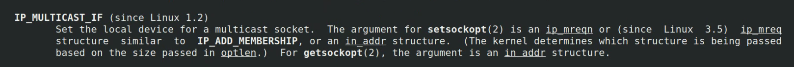

# 流媒体广播系统


## 一、包结构

在 include/proto.h 中定义了三个结构体。包括频道包和节目单包，节目单包中的内容是一个 msg_lisentry_st 结构体的数组。
一个节目单包如下图所示，为了能将节目单中各个频道的内容区分开，在 msg_lisentry_st 结构体中需要定义一个len来记录每个频道内容的长度(类似于TCP的粘包问题)。


### ==多播==

[(45 封私信 / 80 条消息) 现在直播、录播等平台是通过“组播”的方式下发流量的吗？ - 知乎 (zhihu.com)](https://www.zhihu.com/question/65869123)

CDN的全称是Content Delivery Network，即内容分发网络。

==通信框架图==


## 二、客户端的搭建

### 2.1 include/proto.h

#### 2.1.1 关于TCP UDP数据包大小的限制

https://blog.csdn.net/caoshangpa/article/details/51530685

结论：在实际应用中
+ 用UDP协议发送时，用sendto函数最大能发送数据的长度为：65535-IP头(20) - UDP头(8) = 65507 字节
+ 用TCP协议发送时，由于TCP是数据流协议，因此不存在包大小的限制，这是指在使用send函数时，数据长度参数不受限制。而实际上，所指定的这段数据并不一定会一次发送出去，如果这段数据比较长，会被分段发送，如果比较短，可能会等待和下一次数据一起发送。


#### 2.1.2 __attribute__((packed)) 的作用

使用 __attribute__((packed)) 让编译器取消结构体在编译过程中的优化对齐，按照实际占用字节数进行对齐。

而在我们这里定义的结构体是作为通信协议传送的包，所以为了保证在不同平台下，结构体内的基本数据长度相同，就需要取消字节对齐。


#### 2.1.3 关于C语言中的变长数组

https://blog.csdn.net/peng864534630/article/details/77620717

```C
struct msg_channel_st{
	chnid_t chnid;
	uint8_t data[0];
}__attribute__((packed));

```
在 msg_channel_st 这个结构体中，data是一个数组名，但该数组没有元素，实际上，data数组的真实地址紧随着结构体之后。（如果给这个结构体分配的内容大于这个结构体的实际大小，后面多余的部分就是这个data的内容），这种巧妙的方法可以实现变长数组。

有些编译器不允许使用data[0]这样的形式，所以在源码中，使用了data[1]。

**为什么不用指针代替这个数组呢？**
如果使用指针的话，它指向的是一块随机的内存，不能为结构体分配一段连续的内存。


#### 2.1.4 gcc中的 -I 参数

对于`#include <file>`，gcc 会到-I指定的目录中查找，如果找不到，再到系统的缺省的头文件目录查找


### 2.2 client.h 和 client.c

#### 2.2.1 mpg123 中的 - 参数

如果mpg123 命令行中加了 - ，表示mpg123只接收标准输入的内容


#### 2.2.2 可以由用户指定的参数

client.h 中定义了结构体 client_conf_st，里面规定了三个可以由用户指定的参数：接受端口号、多播组地址、播放器。

由于这个结构体不需要在网络中传输，所以我们可以将结构体中的内容定义为char类型的指针。（注意：如果在网络中传输，我们必须传递具体的内容，传递指针是没有意义的）

这三个参数的默认值分别为：

```C
struct client_conf_st client_conf = {.rcvport = DEFAULT_RCVPORT, 
                                     .mgroup = DEFAULT_MGROUP, 
                                     .player_cmd = DEFAULT_PLAYERCMD};
// .运算符表示取成员，这种初始化可以不需要严格按照成员列表顺序初始化
```


#### 2.2.3 getopt 和 getopt_long 函数

https://blog.csdn.net/qq_33850438/article/details/80172275

getopt 函数族作用是解析命令行参数。getopt 函数只能处理短选项。getopt_long 可以处理短选项，也能处理长选项。

```C
int getopt_long(int argc, char * const argv[], const char *optstring, const struct option *longopts, int *longindex);
```

参数以及返回值介绍：

1. **argc 和 argv** ：为 main 函数的两个参数

2. **optstring**：短选项字符串。冒号的含义如下：

   + 字符后面接一个冒号：表示选项后面带一个参数
   + 字符后面接两个冒号：表示选项后面带一个可选参数，如果带参数，则选项与参数直接不能有空格。

3. **longopts**：长选项结构体数组

   ```C
   struct option 
   {  
        const char *name;  		// 长选项名称
        int         has_arg;  		// 是否有参数，0没有，1有，2可选参数
        int        *flag;  		// 返回值选项
        int         val;  			// 指定返回值
   }; 
   // 当flag = NULL 时，getopt_long 找到选项则返回val
   // 当flag != NULL 时，getopt_long 找到选项则返回0，并将flag指针指向val
   ```

4. **longindex**：返回该选项在longopts结构体数组中的下标

5. **全局变量**：其中一个全局变量 optarg 表示当前选项对应的参数值。

6. **返回值**：如果解析完所有字符没有找到，返回-1


#### 2.2.4 socket 套接字

UDP 用的是 SOCK_DGRAM。后一个参数  protocol 设置为0，内核会自动选择协议

```C
sd = socket(AF_INET, SOCK_DGRAM, 0);
```


#### 2.2.5 setsockopt 设置套接字选项

使用 setsockopt 来设置套接字选项


+ 参数 level 设置套接字的级别。由于我们使用的是多播，所以级别为 IPPROTO_IP，表示在ip层设置。

+ 参数 option 表示选项。我们可以在man手册中查看ip层的 socket 选项。`man 7 ip`

  

  

  

  + IP_ADDMEMBERSHIP 加入一个多播组
  + IP_DROP_MEMBERSHIP 离开一个多播组
  + IP_MULTICAST_IF 创建一个多播组

  在客户端我们应该选择加入一个多播组，创建多播组应该交给服务端。

+ 参数 val 表示选项需要传入的参数。

  在 man 手册中可以看到，IP_ADDMEMBERSHIP 需要的参数为一个 ip_mreqn 结构体。

  + imr_multiaddr 表示多播组地址。用 inet_pton() 将点分式转换为二进制地址。

  + imr_address 表示自己的地址。这里可以用 0.0.0.0 。

    > 0.0.0.0的地址表示不确定地址,或“所有地址”、“任意地址”。
    >
    > 如果你的服务器有多个网卡，而你的服务（不管是在udp端口上侦听，还是在tcp端口上侦听），出于某种原因：可能是你的服务器操作系统可能随时增减IP地址，也有可能是为了省去确定服务器上有什么网络端口（网卡）的麻烦 —— 可以要在调用bind()的时候，告诉操作系统：“我需要在 yyyy 端口上侦听，所以发送到服务器的这个端口，不管是哪个网卡/哪个IP地址接收到的数据，都是我处理的。”这时候，服务器则在0.0.0.0这个地址上进行侦听。

  + imr_ifindex 表示接口索引。可以用 ifconfig 可以查看接口名，用函数 if_nametoindex() 可以将接口名转换为接口索引。 也可以在命令行用 `ip ad sh` 查看接口索引。

```C
struct ip_mreqn mreq;	// IP_ADD_MEMBERSHIP 选项的参数
	inet_pton(AF_INET, client_conf.mgroup, &mreq.imr_multiaddr);
	inet_pton(AF_INET, "0.0.0.0", &mreq.imr_address);
	mreq.imr_ifindex = if_nametoindex("eth0");
setsockopt(sd, IPPROTO_IP, IP_ADD_MEMBERSHIP, &mreq, sizeof(mreq)); // 设置socket加入多播组
```


IP_MULTICAST_LOOP 选项可以设置是否允许组播回送。也就是说发送组播数据的主机是否可以作为接收组播数据的组播成员。


#### 2.2.6 绑定套接字和地址

由于我们的客户端属于接收方，所以必须设置端口号，用这个端口号来接收数据。而服务端属于发送方，可以不设置端口号，如果没有设置，系统会给分配一个没人用的随机端口，当进程结束前这个端口都留给这个进程使用，不会给他人使用。


+ 参数 addr 是一个 sockaddr 类型的结构体。

  man 手册中说明，这里的结构体需要像下面这种形式：

  

  我们通常使用头文件 `<netinet/in.h>` 中的 sockaddr_in 结构体，在 `man 7 ip` 中的介绍：

  
  + sin_family 总是设置为 AF_INET
  + sin_port 设置为端口号
  + sin_addr 设置为主机的ip地址


#### 2.2.7 子进程

子进程的作用是从管道中读取数据，并调用解码器

##### 2.2.7.1. 管道

由于子进程只需要从管道中读取数据，所以关闭fd[1]。父进程只需要往管道中写数据，所以关闭fd[0]

(下图来自APUE第三版 15.2)


##### 2.2.7.2. 解码器

利用 execl 执行 shell，并用 shell 来执行解码器。

```C
execl("/bin/sh/", "sh", "-c", client_conf.player_cmd, NULL);	// 利用shell来执行解码器
```


#### 2.2.8 父进程

父进程的作用是从网络上收包，并通过管道发送给子进程

##### 2.2.8.1 收节目单包

UDP是无连接协议，必须使用 sendto 函数来发送数据，必须使用recvfrom 函数接收数据。


sendto 和 send 很类似，区别在于 sendto 可以在无连接的套接字上指定一个目标地址。对于面向连接的套接字，目标地址是被忽略的，因为连接中隐含了目标地址。对于无连接的套接字，除非先调用 connect 设置了目标地址，否则不能用 send 。

recvfrom 与 recv 很类似，区别在于，使用 recvfrom 可以得到发送端的源地址。

```C
len = recvfrom(sd, msg_list, MSG_LIST_MAX, 0, (void *)&serveraddr, &serveraddr_len); 
```

**为什么是 `(void *)&serveraddr` ？**

因为第五个参数需要接收一个 (void *) 类型的参数。

==**可不可以写得简单一点？**==


##### 2.2.8.2 打印节目单并选择频道

**这个 for 循环应该怎么写？**

定义一个pos指针，指针从 msg_list->entry 数组的第一个 msg_listentry_st 结构体开始。每次读一个结构体。读到最后一个结束，也就是 msg_list + len 位置。

由于 pos->len 是从网络中来的数据，所以需要用 ntohs 转换字节序。

```C
struct msg_listentry_st *pos;	// 指向节目单中的每个频道的内容结构体
for(pos = msg_list->entry; 
    (char *)pos < (((char*)msg_list) + len);
    pos = (void*)(((char *)pos)+ntohs(pos->len))){
    printf("channel %d : %s\n", pos->chnid, pos->desc);	
}
```


##### 2.2.8.3 收频道包

与收节目单包类似。


##### 2.2.8.4 将频道包发送给子进程：writen 函数

在 APUE 第3版 14.7 中定义了 readn 函数 和 writen 函数 ：

> 在管道、FIFO以及某些设备（特别是终端和网络）有下列两种性质：
>
> （1）一次 read 操作所返回的数据可能少于所要求的数据，即使还没达到文件尾也可能是这样。这不是一个错误，应当继续读该设备。
>
> （2）一次 write 操作的返回值也可能少于指定输出的字节数。这可能是由于某个因素造成的，例如，内核输出缓冲区变满。这也不是错误，应该继续写余下的数据。（通常，只有非阻塞描述符，或捕捉到一个信号时，才发生这种 write 的中途返回）
>
> 在读、写磁盘文件时从未见到过这种情况，除非文件系统用完了空间，或者接近了配额限制，不能将要求写的数据全部写出。
>
> 通常，在读、写一个管道、网络设备或终端时，需要考虑这些特性。下面两个函数 readn 和 writen 的功能分别是读、写指定的 N 个字节数据，并处理返回值小于要求值的情况。这两个函数只是按需多次调用 read 和 write 直至读、写了 N 个字节数据。
>
> 
>
> 在要将数据写到上面提到的文件类型上时，就可以调用 written ，但是仅当事先就知道要接收数据的数量时，才调用 readn 。


## 三、服务端框架搭建

### 3.1 server_conf.h

#### 3.1.1 enum

枚举语法定义格式为：

```
enum 枚举名 {枚举元素1， 枚举元素2，...}

```

第一个枚举元素的默认值为0，后面没有指定值的枚举元素，其值为前一元素加1。

这里将运行模式定义为枚举类型，运行模式为守护进程时，runmode = RUN_DAEMON, 为前台运行时，runmode = RUN_FOREGROUND

#### 3.1.2 extern

结构体 server_conf_st 用来表示服务器中的设置。

由于server文件夹中有多个文件，我们希望在所有的文件中都能访问到服务器的设置，所以在 server_conf.h 中用 extern 关键字声明了 server_conf 这样我们在所有的文件中都可以访问它了。

### 3.2 server.c

#### 3.2.1 服务端框架

服务端分为以下几个部分：

1. 命令行分析
2. 守护进程实现
3. socket 初始化
4. 获取频道信息
5. 创建节目单线程
6. 创建频道线程

下面开始实现这几个部分。

## 四、守护进程的实现

### 4.1 设置守护进程

编写 daemonize() 函数将当前进程设置为守护进程。具体操作为：

#### 4.1.1 设置文件权限 umask(0)

因为守护进程继承了父进程的文件权限，而守护进程可能要设置特定的权限，所以我们通过 umask(0) 来设置守护进程的权限，为了不受父进程的 umask 的影响，能自由创建读写文件和目录。


#### 4.1.2 调用 fork()

调用fork，然后使父进程 exit。这样做实现了下面几点：

+ 如果该守护进程是作为一条简单的 shell 命令启动的，那么父进程终止会让 shell 认为这条命令已经执行完毕
+ 用子进程来做守护进程，可以保证子进程不是一个进程组的组长进程。这样做是为了下面调用 setsid 函数的时候不会报错。


#### 4.1.3 调用 setsid()

调用 setsid() 创建一个会话，这会发生以下3件事：

+ 该进程变成新会话的会话首进程。此时，该进程是新会话中的唯一进程。
+ 该进程成为一个新进程组的组长进程。
+ 该进程没有控制终端。


#### 4.1.4 更改工作目录

将当前工作目录更改为根目录。从父进程继承过来的工作目录可能在一个挂载的文件系统中。因为守护进程通常在系统再引导之前是一直存在的，所以如果守护进程的当前工作目录在一个挂在文件系统中，那么该文件系统就不能被卸载。

```C
chdir("/");	
```


#### 4.1.5 关闭不再需要的文件描述符

使守护进程不再持有从其父进程继承来的任何文件描述符。


#### 4.1.6 将文件描述符 0,1,2 指向空洞文件

```C
fd = open("/dev/null/", O_RDWR);
if(fd < 0){
    syslog(LOG_WARNING, "open():%s", strerror(errno));
    return -2;
} else {
    dup2(fd, 0);
    dup2(fd, 1);
    dup2(fd, 2);

    if(fd > 2){
        close(fd);
    }
}
```


### 4.2 系统日志

由于守护进程是脱离终端的，所以不能将出错的消息写到标准错误上。所以出错的消息需要记录在系统日志中。


+ `openlog()` ：指定一个 ident 字段（指定人物，随便写），此ident 将被加至每则日志消息中。option 一般用 LOG_PID。facility 是消息来源。

+ `syslog()` ：产生一个日志消息。priority 是 facility 和 level 的组合。下面是 facility 参数 和 level 参数的部分说明。format 指的是要写入日志的内容，类似与 printf 的用法。**但是 `\n` 这类格式控制符是无效的，因为系统日志的格式是由 syslogd 服务来控制的。** 

+ `closelog()`： 关闭曾被用于与 syslogd 守护进程进行通信的描述符。


### 4.3 守护进程的结束

我们可以用信号来使守护进程正常终止，在信号处理函数中，我们还可以释放我们使用的资源，如关闭系统日志。

signal 会产生重入现象，所以在这里我们使用 sigaction，sigaction 可以指定，在执行信号处理函数的时候，不希望被哪些信号打断。


其中 sigaction 结构体为：


+ sa_handler ：信号处理函数，只有一个参数，参数为该信号对应的编码。 
+ sa_mask ：一个信号集，里面有需要阻塞的信号。利用 sigaddset() 函数将信号加入信号集。
+ sa_flags ：表示要对这个信号进行什么处理。
+ sa_sigaction ：信号处理函数，有三个参数。这个字段和 sa_handler 字段只能使用其中一个。


